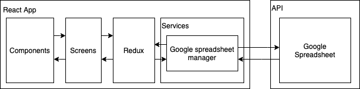

# SC3 - (Salimos Codo a Codo Commerce)

## Introducción 
Esta plataforma se crea debido a la problemática que afrontan las PYMES por la pandemia de COVID-19.

## Que es?
Gestor de pedidos para PYMES **100% gratuito**, con control de stock y administrado desde una simple hoja de cálculo de Google.
Los nuevos pedidos se registran en la hoja de cálculo y al mismo tiempo, se notifican a través de una cuenta de email.

## Objetivo
Colaborar con las PYMES que están afontando una crisis, abriendo un nuevo canal de ventas .

## Datos técnicos
> Sitio web realizado en **React** + **Redux** utilizando el concepto de diseño "Mobile First".

### Arquitectura


## Onboarding

### 1. Crear una nueva spreadsheet y compartirla

Compartir tu spreadsheet con "link sharing": *Anyone with th link can edit*.


### 2. Copiar el ID de la hoja de cálculo

Por ejemplo, en `https://docs.google.com/spreadsheets/d/1qffzsCf2siRv-loAAMLeGzsSsmwcT3odSfmXBASO0fg/edit#gid=0` el ID es `1qffzsCf2siRv-loAAMLeGzsSsmwcT3odSfmXBASO0fg`.

### 3. Generar el archivo JSON

#### Inicializar el proyecto y habilitar "sheets API"

1. Ir a[Google Developers Console](https://console.developers.google.com/)
2. Seleccionar tu proyecto o crear uno nuevo y seleccionarlo
3. Habilitar "Sheets API" para tu proyecto
4. En la barra lateral, seleccionar APIs & Services > Library
5. Buscar "sheets"
6. Click en "Google Sheets API"
7. Click en el botón azul "Enable"

#### Crear una "service account" para tu proyecto

1. En la barra lateral, seleccionar APIs & Services > Credentials
2. Click en "+ CREATE CREDENITALS" y seleccionar  "Service account"
3. Ingresar nombre, descripción y hacer click en "CREATE"
4. Click en "CONTINUE"
5. Click en el botón "+ CREATE KEY"
6. Seleccionar "JSON"
7. Click en el botón "Create"
8. Se generará un archivo JSON que deberemos descargar para luego agregarlo al proyecto.
9. Click en "DONE"

#### Configurar proyecto

1. Cofigurar .env siguiendo el ejemplo
```
NOMBRE_EMPRESA=SalimosCodoaCodo
GOOGLE_SPREADSHEET_ID=1qffzsCf2siRv-loAAMLeGzsSsmwcT3odSfmXBASO0fg

EMAIL_ACCOUNT=joaquinbeceiro@gmail.com
EMAIL_SECRET=abcdefghijklmnop
EMAIL_FROM_ADDR=joaquinbeceiro@gmail.com
EMAIL_HOST=smtp.gmail.com
```

2. Agregar el archivo "JSON" descargado anteriormente en la raíz del proyecto con el nombre `google.json`.


## Authors

**Joaquin Beceiro** 
- [GitHub](https://github.com/JoaquinBeceiro) 
- [Web](https://JoaquinBeceiro.com.uy)